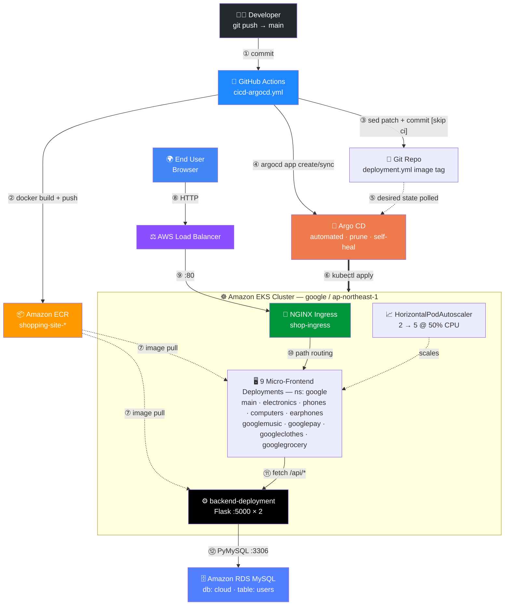
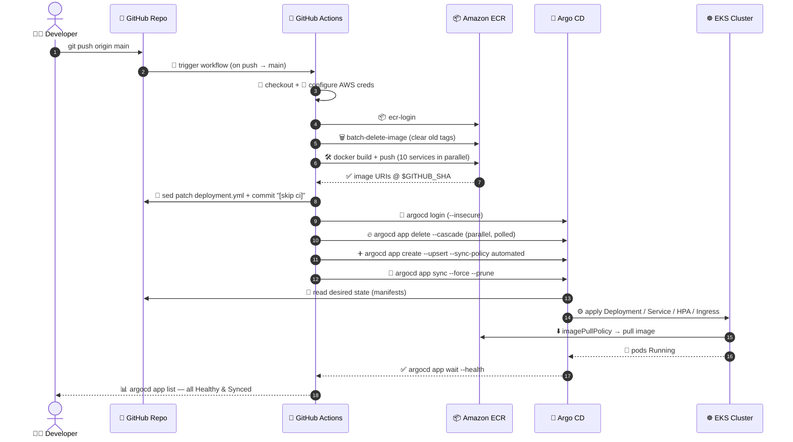
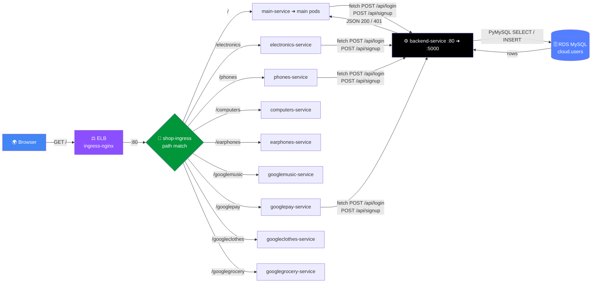

<div align="center">


# 🛒 Google Store — DevOps Project

### Micro-frontend E-Commerce Platform on **AWS EKS** with a **GitOps** delivery pipeline

<p>


</p>
<p>


</p>

<p>


</p>

</div>

---

## 📑 Table of Contents

| # | Section | # | Section |
|:-:|:--|:-:|:--|
| 1 | [🎯 Overview](#-overview) | 7 | [🚀 Setup — Step by Step](#-setup--step-by-step) |
| 2 | [🧰 Tech Stack](#-tech-stack) | 8 | [🔐 GitHub Secrets](#-github-secrets-required) |
| 3 | [🏗 High-Level Architecture](#-high-level-architecture) | 9 | [🗄 Database Schema](#-database-schema) |
| 4 | [🔁 CI/CD Flow (Arrow-by-Arrow)](#-cicd-flow--arrow-by-arrow) | 10 | [🌐 Route Map](#-route-map) |
| 5 | [🌍 Request Flow (User → Pod → DB)](#-request-flow--user--pod--db) | 11 | [🛠 Troubleshooting](#-troubleshooting) |
| 6 | [📂 Repository Layout](#-repository-layout) | 12 | [⚠️ Security Notes](#-security-notes) |

---

## 🎯 Overview

A Google-Store style shopping site split into **9 independent micro-frontends** plus **1 Flask backend API**, each with its own Docker image, Deployment, Service and Horizontal Pod Autoscaler. Everything is deployed to a single **Amazon EKS** cluster, exposed through one **NGINX Ingress**, and continuously delivered by **GitHub Actions → Amazon ECR → Argo CD**.

| 🧩 What | 📊 Detail |
|:--|:--|
| 🖥 Micro-frontends | `main` · `electronics` · `phones` · `computers` · `earphones` · `googlemusic` · `googlepay` · `googleclothes` · `googlegrocery` |
| ⚙️ Backend | Flask REST API — `/api/signup`, `/api/login`, `/api/users` on port `5000` |
| 🗄 Database | Amazon RDS for MySQL — database `cloud`, table `users` |
| 📦 Registry | Amazon ECR — `shopping-site-<service>` repositories |
| 🚢 Delivery | GitHub Actions builds & pushes → patches image tag in Git → Argo CD syncs cluster |
| 📈 Scaling | HPA per service — `2 → 5` replicas at `50%` CPU |
| 🌏 Region | `ap-northeast-1` (Tokyo) · Cluster `google` · Namespace `google` |

---

## 🧰 Tech Stack

<div align="center">

| Layer | Technology | Icon |
|:--|:--|:-:|
| 🎨 Frontend | HTML5 · CSS3 · Vanilla JS served by NGINX Alpine |    |
| ⚙️ Backend | Python 3.9 · Flask · PyMySQL · Werkzeug hashing |   |
| 📦 Container | Docker multi-service images |  |
| ☸️ Orchestration | Amazon EKS · eksctl · kubectl · HPA |  |
| 🚦 Networking | NGINX Ingress Controller · AWS Load Balancer |  |
| 🔄 CI | GitHub Actions (parallel matrix-style builds) |  |
| 🎯 CD | Argo CD — automated sync, auto-prune, self-heal |  |
| 🗄 Data | Amazon RDS for MySQL / MariaDB client |  |

</div>

---

## 🏗 High-Level Architecture

> Arrows show **direction of traffic and artifacts** — from developer commit all the way down to the database.



---

## 🔁 CI/CD Flow — Arrow by Arrow

Every step below maps 1:1 to a job step in [`.github/workflows/cicd-argocd.yml`](.github/workflows/cicd-argocd.yml).



### 🔍 Pipeline stages at a glance

| # | Step | Icon | What happens | Direction |
|:-:|:--|:-:|:--|:--|
| 1 | Checkout | 🧾 | `actions/checkout@v4` with `GIT_PAT` | GitHub ➜ Runner |
| 2 | AWS auth | 🔧 | `configure-aws-credentials@v4` | Runner ➜ AWS STS |
| 3 | ECR login | 📦 | `amazon-ecr-login@v2` | Runner ➜ ECR |
| 4 | Clean + Build + Push | 🗑🛠 | Deletes old images, creates repo if missing, builds **10 images in parallel** | Runner ➜ ECR |
| 5 | Patch manifests | 🔄 | `sed` rewrites `image:` in every `deployment.yml` | Runner ➜ Git |
| 6 | Validate secrets | ✅ | Fails fast if Argo CD secrets missing | Runner (local) |
| 7 | Install Argo CD CLI | 🔽 | Downloads `argocd-linux-amd64` | GitHub ➜ Runner |
| 8 | Login | 🔐 | `argocd login $ARGOCD_SERVER` | Runner ➜ Argo CD |
| 9 | Delete old apps | 🔥 | `app delete --cascade` + poll until gone | Runner ➜ Argo CD ➜ EKS |
| 10 | Recreate apps | ➕ | `app create --upsert --auto-prune --self-heal` | Runner ➜ Argo CD |
| 11 | Sync + wait | 🚀 | `app sync --force --prune`, retry ×3, `app wait --health` | Argo CD ➜ EKS |
| 12 | Report | 📊 | `argocd app list` (runs `if: always()`) | Argo CD ➜ Logs |

> 💡 The `[skip ci]` marker on the auto-commit is what prevents the image-tag commit from re-triggering the workflow (infinite loop guard).

---

## 🌍 Request Flow — User → Pod → DB



Each frontend image ships its own `nginx.conf` with an `alias` block so the app works both at `/` and under its sub-path (e.g. `location /phones/ { alias /usr/share/nginx/html/; }`), plus a `301` redirect for the no-trailing-slash form.

---

## 📂 Repository Layout

```
Google-Store-DevOps-Project/
│
├── 📁 .github/workflows/
│   └── ⚙️  cicd-argocd.yml          # 🔄 Full CI/CD: build → push → patch → Argo CD sync
│
├── 📁 backend/                       # ⚙️ Flask API (Argo CD app: "backend")
│   ├── 🐍 app.py                     #    /api/signup · /api/login · /api/users
│   ├── 🐍 rds                        #    Extra receipts/orders API (RDS variant)
│   ├── 📋 requirements.txt           #    flask · flask_cors · pymysql
│   ├── 🐳 Dockerfile                 #    python:3.9-slim ➜ EXPOSE 5000
│   ├── ☸️  backend-deployment.yml     #    2 replicas, image patched by CI
│   └── ☸️  backend-service.yml        #    LoadBalancer 80 ➜ 5000
│
└── 📁 frontend/                      # 🖥 9 micro-frontends, one Argo CD app each
    ├── 🏠 main/                      #    ➜ /              (also holds ingress.yml)
    │   ├── 📄 index.html
    │   ├── 🐳 Dockerfile             #    nginx:alpine ➜ EXPOSE 80
    │   ├── ☸️  deployment.yml
    │   ├── ☸️  service.yml
    │   ├── 📈 autoscaler.yml         #    HPA 2 ➜ 5 @ 50% CPU
    │   └── 🚦 ingress.yml            #    ⭐ single Ingress for ALL routes
    ├── 💡 electronics/               #    ➜ /electronics
    ├── 📱 phones/                    #    ➜ /phones
    ├── 💻 computers/                 #    ➜ /computers
    ├── 🎧 earphones/                 #    ➜ /earphones
    ├── 🎵 googlemusic/               #    ➜ /googlemusic
    ├── 💳 googlepay/                 #    ➜ /googlepay
    ├── 👕 googleclothes/             #    ➜ /googleclothes
    └── 🛍 googlegrocery/             #    ➜ /googlegrocery
```

Every frontend folder follows the same contract: `index.html` + `style.css` + `script.js` + `nginx.conf` + `Dockerfile` + `deployment.yml` + `service.yml` + `autoscaler.yml`. Because Argo CD points at the folder, **adding a service = adding a folder** and registering it in the workflow env vars.

---

## 🚀 Setup — Step by Step

### 1️⃣ Prerequisites

```bash
# eksctl
curl --silent --location "https://github.com/weaveworks/eksctl/releases/latest/download/eksctl_$(uname -s)_amd64.tar.gz" | tar xz -C /tmp
sudo mv /tmp/eksctl /usr/local/bin
eksctl version

# kubectl
curl -LO "https://dl.k8s.io/release/$(curl -Ls https://dl.k8s.io/release/stable.txt)/bin/linux/amd64/kubectl"
chmod +x ./kubectl && sudo mv ./kubectl /usr/local/bin/kubectl

# docker + git
sudo yum install -y docker git && sudo systemctl enable --now docker
```

### 2️⃣ Create the EKS cluster ☸️

```bash
eksctl create cluster \
  --name google \
  --region ap-northeast-1 \
  --node-type t3.medium \
  --nodes 2

aws eks update-kubeconfig --name google --region ap-northeast-1
kubectl get nodes
```

### 3️⃣ Namespace 📁

```bash
kubectl create namespace google
```

### 4️⃣ NGINX Ingress Controller 🚦

```bash
kubectl apply -f https://raw.githubusercontent.com/kubernetes/ingress-nginx/main/deploy/static/provider/cloud/deploy.yaml

kubectl get pods -n ingress-nginx
kubectl get svc  -n ingress-nginx   # ⬅️ copy EXTERNAL-IP (the ELB DNS name)
```

### 5️⃣ Metrics Server 📈 (required for HPA)

```bash
kubectl apply -f https://github.com/kubernetes-sigs/metrics-server/releases/latest/download/components.yaml
kubectl top pods -n google
```

### 6️⃣ Argo CD 🎯

```bash
kubectl create namespace argocd
kubectl apply -n argocd -f https://raw.githubusercontent.com/argoproj/argo-cd/stable/manifests/install.yaml

# expose the UI/API
kubectl patch svc argocd-server -n argocd -p '{"spec": {"type": "LoadBalancer"}}'
kubectl get svc -n argocd

# initial admin password
kubectl -n argocd get secret argocd-initial-admin-secret \
  -o jsonpath="{.data.password}" | base64 -d && echo
```

### 7️⃣ Database client + schema 🗄

```bash
sudo yum update -y
sudo dnf install -y mariadb105

mysql -h <RDS_ENDPOINT> -u admin -p
```

### 8️⃣ Trigger the pipeline 🚀

```bash
git commit --allow-empty -m "🚀 trigger deploy"
git push origin main
```

Then watch it land:

```bash
argocd app list
kubectl get pods,svc,hpa,ingress -n google
```

---

## 🔐 GitHub Secrets Required

Set these in **Settings ➜ Secrets and variables ➜ Actions**.

| 🔑 Secret | 🎯 Used for | Referenced in |
|:--|:--|:--|
| `AWS_ACCOUNT_ID` | Builds the `ECR_REGISTRY` hostname | `env.ECR_REGISTRY` |
| `AWS_ACCESS_KEY_ID` | AWS auth for ECR push | Step 🔧 |
| `AWS_SECRET_ACCESS_KEY` | AWS auth for ECR push | Step 🔧 |
| `GIT_PAT` | Checkout + push the patched `deployment.yml` back to `main` | Steps 🧾 / 🔄 |
| `ARGOCD_SERVER` | Argo CD API endpoint (ELB DNS) | Step 🔐 |
| `ARGOCD_USERNAME` | Argo CD login (usually `admin`) | Step 🔐 |
| `ARGOCD_PASSWORD` | Argo CD login | Step 🔐 |

> 🛡 Recommended: replace the static IAM keys with **GitHub OIDC + an assumed IAM role** so no long-lived credentials live in the repo.

---

## 🗄 Database Schema

```sql
CREATE DATABASE IF NOT EXISTS cloud;
USE cloud;

DROP TABLE IF EXISTS users;
CREATE TABLE users (
    id         INT AUTO_INCREMENT PRIMARY KEY,
    username   VARCHAR(100) NOT NULL UNIQUE,
    full_name  VARCHAR(150) NOT NULL,
    email      VARCHAR(150) NOT NULL UNIQUE,
    password   VARCHAR(255) NOT NULL,          -- werkzeug pbkdf2 hash
    created_at TIMESTAMP DEFAULT CURRENT_TIMESTAMP,
    updated_at TIMESTAMP DEFAULT CURRENT_TIMESTAMP ON UPDATE CURRENT_TIMESTAMP
);
```

### 🔌 API Endpoints

| Method | Endpoint | Body | ✅ Success | ❌ Errors |
|:--|:--|:--|:--|:--|
| `POST` | `/api/signup` | `username`, `email`, `password` | `201` User registered | `400` missing fields / email exists · `500` |
| `POST` | `/api/login` | `email`, `password` | `200` + user object | `400` missing · `401` invalid · `500` |
| `GET`  | `/api/users` | — | `200` + user list | `500` |

Passwords are hashed with `generate_password_hash` and verified with `check_password_hash` — plaintext is never stored.

---

## 🌐 Route Map

All routes are served by the single `shop-ingress` defined in `frontend/main/ingress.yml`.

| 🎯 Path | ☸️ Service | 🖥 Micro-frontend | 🐳 ECR Repository |
|:--|:--|:--|:--|
| `/` | `main-service` | 🏠 main | `shopping-site-main` |
| `/electronics` | `electronics-service` | 💡 electronics | `shopping-site-electronics` |
| `/phones` | `phones-service` | 📱 phones | `shopping-site-phones` |
| `/computers` | `computers-service` | 💻 computers | `shopping-site-computers` |
| `/earphones` | `earphones-service` | 🎧 earphones | `shopping-site-earphones` |
| `/googlemusic` | `googlemusic-service` | 🎵 googlemusic | `shopping-site-googlemusic` |
| `/googlepay` · `/payment` | `googlepay-service` · `payment-service` | 💳 googlepay | `shopping-site-googlepay` |
| `/googleclothes` | `googleclothes-service` | 👕 googleclothes | `shopping-site-googleclothes` |
| `/googlegrocery` | `googlegrocery-service` | 🛍 googlegrocery | `shopping-site-googlegrocery` |
| `/api/*` | `backend-service` ➜ `:5000` | ⚙️ Flask API | `shopping-site-backend` |

> ⚠️ `ingress.yml` has an empty `host:` (matches any host) and a `/payment` rule pointing at a `payment-service` that no folder creates. Set the host to your ELB/domain and either add the service or drop that rule.

---

## 🛠 Troubleshooting

| 🚨 Symptom | 🔎 Likely cause | 🩹 Fix |
|:--|:--|:--|
| `ImagePullBackOff` | Nodes lack ECR pull permission, or the tag was deleted by the cleanup step | Attach `AmazonEC2ContainerRegistryReadOnly` to the node role · re-run the workflow |
| Ingress `ADDRESS` empty | Ingress controller LB still provisioning | `kubectl get svc -n ingress-nginx -w` |
| `404` on a sub-path | `nginx.conf` alias missing or Ingress rule absent | Check `location /<svc>/ { alias ... }` and `ingress.yml` |
| HPA shows `<unknown>` CPU | Metrics Server not installed, or no `resources.requests` set | Install Metrics Server; add CPU requests to containers |
| Argo CD app `OutOfSync` forever | Auto-sync raced with the manual sync | Workflow already calls `terminate-op` + retries ×3; check `argocd app get <app>` |
| Backend `500` on signup/login | RDS security group blocks the nodes, or wrong endpoint | Allow `3306` from the node security group; verify the host in `app.py` |
| Workflow loops endlessly | `[skip ci]` marker stripped from the auto-commit | Keep `[skip ci]` in the commit message |
| `argocd login` fails | `ARGOCD_SERVER` wrong or LB not reachable | `kubectl get svc argocd-server -n argocd` and update the secret |

Handy commands:

```bash
kubectl get pods -n google -o wide
kubectl logs -f deploy/backend-deployment -n google
kubectl describe ingress shop-ingress -n google
kubectl get hpa -n google
argocd app get main
argocd app history backend
```

---

## ⚠️ Security Notes

These are real findings in the current code — worth fixing before any non-demo use.

| 🔴 Severity | Finding | Recommendation |
|:-:|:--|:--|
| 🔴 High | `backend/app.py` hardcodes the RDS **host, user and password** in source | Move to a Kubernetes `Secret` / AWS Secrets Manager and read via env vars |
| 🔴 High | `backend/rds` also contains a hardcoded password | Same — externalise, then rotate the exposed credential |
| 🟠 Medium | `backend-service.yml` and every frontend `service.yml` are `type: LoadBalancer` | Switch to `ClusterIP` and route everything through the single Ingress — cheaper and smaller attack surface |
| 🟠 Medium | `/api/*` has **no authentication, rate limiting or session tokens** | Add JWT/session auth and rate limiting before exposing publicly |
| 🟠 Medium | `argocd login --insecure` and `--sync-policy automated --auto-prune` in CI | Use a proper TLS cert; scope auto-prune carefully |
| 🟡 Low | `CORS(app)` allows all origins | Restrict to the known frontend origin(s) |
| 🟡 Low | Pipeline deletes **all** ECR images every run — no rollback target | Keep the last N tags; use an ECR lifecycle policy instead |
| 🟡 Low | No `resources.requests/limits` on containers | Add them so HPA and the scheduler behave predictably |

---

## 📸 Reference Diagrams

<div align="center">

**Cluster Architecture**


**Workflow Diagram**


</div>

---

<div align="center">

### ⭐ Built with Docker, Kubernetes, GitHub Actions & Argo CD on AWS


**[⬆ Back to top](#-google-store--devops-project)**

</div>
